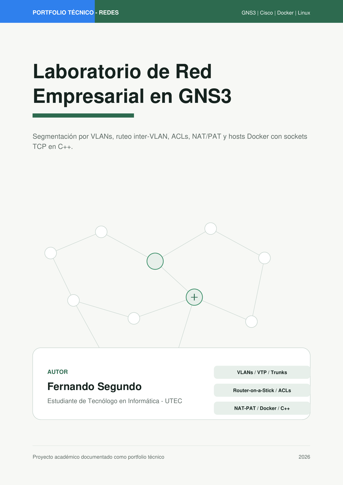
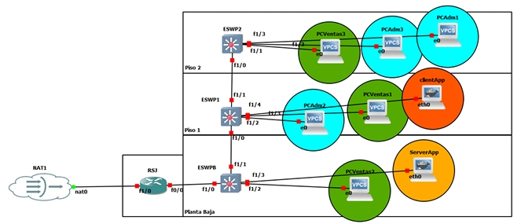

# GNS3 Enterprise Network Lab

Proyecto académico de redes implementado en **GNS3**, orientado a simular una red empresarial segmentada por áreas. El laboratorio incluye configuración de VLANs, VTP, enlaces trunk, Router-on-a-Stick, DHCP, ACLs, NAT/PAT, hosts Docker y una aplicación cliente-servidor en C++ usando sockets TCP.

## Objetivo del proyecto

El objetivo fue diseñar, implementar y documentar una red empresarial con tres sectores principales:

* Administración
* Ventas
* Aplicación

Cada sector fue separado mediante VLANs. La comunicación entre redes fue controlada mediante ACLs en el router, permitiendo únicamente el tráfico necesario. Además, se configuró salida a Internet mediante NAT/PAT y se validó la comunicación entre hosts de aplicación usando una aplicación TCP desarrollada en C++.

## Tecnologías y herramientas utilizadas

* GNS3
* Cisco IOS
* Router Cisco 7200
* Switches ESW sobre c3725
* VLANs
* VTP
* Trunking 802.1Q
* Router-on-a-Stick
* DHCP
* ACLs
* NAT/PAT
* Docker
* Ubuntu 22.04
* C++
* Sockets TCP
* Wireshark
* Tailscale

## Topología

La red representa una empresa distribuida en tres niveles físicos:

* Planta Baja
* Piso 1
* Piso 2

Los switches están conectados mediante enlaces trunk. El router se encarga del ruteo inter-VLAN mediante subinterfaces y también provee DHCP, ACLs y NAT/PAT.



## Segmentación de red

La red base utilizada fue `192.168.1.0/24`, subdividida en subredes `/26`.

| Área           | VLAN | Red              | Gateway       | Uso                                 |
| -------------- | ---: | ---------------- | ------------- | ----------------------------------- |
| Administración |   10 | 192.168.1.0/26   | 192.168.1.1   | Hosts administrativos por DHCP      |
| Ventas         |   20 | 192.168.1.64/26  | 192.168.1.65  | Hosts de ventas por DHCP            |
| Aplicación     |   30 | 192.168.1.128/26 | 192.168.1.129 | ServerApp y ClientApp con IP manual |
| Reservada      |   40 | 192.168.1.192/26 | 192.168.1.193 | Subred reservada                    |

## Hosts de aplicación

| Host      | IP               | Gateway       | Rol                         |
| --------- | ---------------- | ------------- | --------------------------- |
| ServerApp | 192.168.1.130/26 | 192.168.1.129 | Servidor TCP en puerto 8080 |
| ClientApp | 192.168.1.190/26 | 192.168.1.129 | Cliente TCP                 |

Los hosts de aplicación fueron implementados como contenedores Docker dentro de GNS3, usando una imagen propia basada en Ubuntu 22.04.

## Funcionalidades implementadas

### VLANs y VTP

Se crearon VLANs para separar las áreas de la red. La propagación de VLANs entre switches se realizó mediante VTP versión 2, usando el dominio `REDES`.

VLANs configuradas:

* VLAN 10: ADM
* VLAN 20: VENTAS
* VLAN 30: APP

### Enlaces trunk

Los enlaces entre switches y el enlace hacia el router fueron configurados como trunk 802.1Q, permitiendo transportar las VLANs 10, 20 y 30.

### Router-on-a-Stick

El router utiliza subinterfaces sobre una interfaz física para realizar ruteo inter-VLAN.

Subinterfaces principales:

* `FastEthernet0/0.10`
* `FastEthernet0/0.20`
* `FastEthernet0/0.30`

Cada subinterfaz tiene encapsulación 802.1Q y actúa como gateway de su VLAN correspondiente.

### DHCP

El router fue configurado como servidor DHCP para las VLANs de Administración y Ventas.

La VLAN de Aplicación utiliza direccionamiento manual, ya que los hosts ServerApp y ClientApp necesitan IPs fijas para las pruebas de sockets TCP.

### ACLs de segmentación

Se aplicaron ACLs extendidas de entrada en las subinterfaces del router para limitar la comunicación entre VLANs.

Criterios principales:

* Bloquear comunicación directa entre Administración y Ventas.
* Bloquear acceso desde Administración y Ventas hacia Aplicación.
* Permitir comunicación necesaria entre ClientApp y ServerApp.
* Permitir salida a Internet para los hosts autorizados.
* Permitir tráfico DHCP mediante UDP 67/68.

### Aplicación cliente-servidor en C++

Se desarrolló una aplicación simple en C++ usando sockets TCP.

El servidor escucha en el puerto `8080`, recibe un mensaje del cliente y responde con un texto.

Archivos principales:

* `src/serverApp.cpp`
* `src/clienteApp.cpp`

Compilación:

```bash
g++ serverApp.cpp -o servidor
g++ clienteApp.cpp -o cliente
```

Ejecución:

```bash
./servidor
./cliente
```

### NAT/PAT

Se configuró NAT/PAT para permitir salida a Internet desde los hosts autorizados de la VLAN de Aplicación.

El router usa una única dirección de salida y diferencia las conexiones mediante puertos, usando `overload`.

### Wireshark

Se utilizó Wireshark para verificar el tráfico TCP entre ClientApp y ServerApp, incluyendo el 3-way handshake.

## Docker

La imagen Docker utilizada se basa en Ubuntu 22.04 e incluye herramientas necesarias para compilar, ejecutar y diagnosticar conectividad de red.

Paquetes principales:

* `g++`
* `iproute2`
* `iputils-ping`
* `net-tools`
* `curl`
* `telnet`

Dockerfile:

```dockerfile
FROM ubuntu:22.04

ENV DEBIAN_FRONTEND=noninteractive

RUN apt update && apt install -y \
    g++ \
    iproute2 \
    iputils-ping \
    net-tools \
    curl \
    telnet \
    && rm -rf /var/lib/apt/lists/*

WORKDIR /app
```

Configuración manual de IP dentro de los contenedores:

```bash
# ServerApp
ip addr add 192.168.1.130/26 dev eth0
ip route add default via 192.168.1.129

# ClientApp
ip addr add 192.168.1.190/26 dev eth0
ip route add default via 192.168.1.129
```

## Acceso al laboratorio

El laboratorio fue ejecutado sobre un servidor casero con GNS3 Server. La administración se realizó desde una PC Windows usando la GUI de GNS3, conectada al servidor mediante Tailscale.

Esto permitió trabajar sobre el servidor sin exponer directamente GNS3 a Internet.

## Estructura del repositorio

```text
.
├── README.md
├── docs/
│   └── proyecto_gns3_enterprise_network_lab.pdf
├── configs/
│   ├── router-rsj.txt
│   ├── eswpb.txt
│   ├── eswp1.txt
│   └── eswp2.txt
├── docker/
│   └── Dockerfile
├── src/
│   ├── serverApp.cpp
│   └── clienteApp.cpp
└── images/
    └── topologia.png
    └── caratula.png
```

## Problemas encontrados

Durante la implementación se encontraron y resolvieron varios problemas técnicos:

* DHCP bloqueado por ACLs.
* Tráfico UDP 67/68 necesario para DHCP.
* Configuración incorrecta de enlaces trunk.
* Ruta por defecto hacia el nodo NAT de GNS3.
* Persistencia de configuración IP en contenedores Docker.

## Aprendizajes principales

Este proyecto permitió reforzar conceptos fundamentales de redes, entre ellos:

* Subnetting con VLSM básico.
* Segmentación mediante VLANs.
* Propagación de VLANs con VTP.
* Configuración de enlaces trunk.
* Ruteo inter-VLAN con Router-on-a-Stick.
* Control de tráfico mediante ACLs.
* Configuración de DHCP en router Cisco.
* NAT/PAT para salida a Internet.
* Uso de Docker como hosts dentro de GNS3.
* Diagnóstico de conectividad con ping, telnet, curl y Wireshark.
* Programación de sockets TCP en C++.
* Documentación técnica de una implementación de red.

## Autor

**Fernando Segundo**
Estudiante de Tecnólogo en Informática — UTEC
Interesado en redes, infraestructura, soporte IT, Linux, Docker y homelab.
